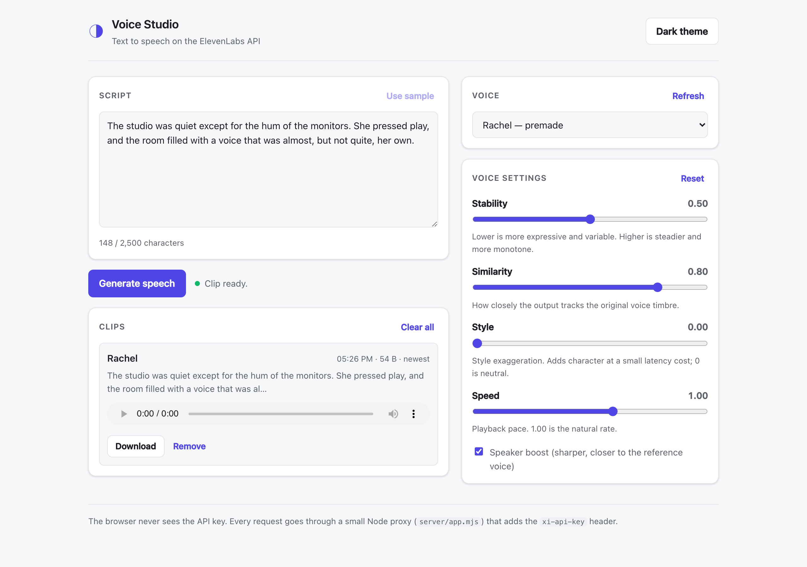
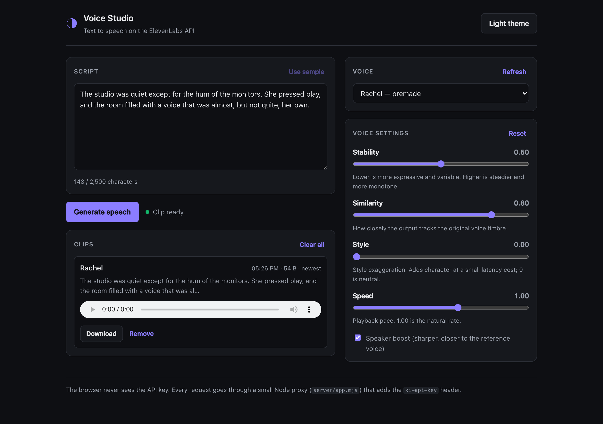

# Voice Studio

A small text-to-speech studio built on the [ElevenLabs](https://elevenlabs.io) API.
Type a script, pick a voice, tune the delivery, and get an MP3 back. The browser
never sees the API key: every request goes through a thin Node proxy that adds the
`xi-api-key` header server-side. Every synthesis is also logged to MongoDB, and a
GraphQL endpoint over that history powers a "what have I generated" panel — the
data layer this README's [Data & GraphQL](#data--graphql) section walks through.

Built as a focused sample: React 18 + TypeScript on the front, Express + MongoDB +
GraphQL on the back, Vitest for the tests (including a real, ephemeral MongoDB in
CI, not a mock), and a CI workflow that runs lint, types, tests, and the build on
every push.



<details>
<summary>Dark theme</summary>



</details>

## Why it is shaped this way

- **The key stays on the server.** A common mistake with the ElevenLabs API is to
  call it straight from the browser and ship the key in the bundle. `server/app.mjs`
  is the whole fix: the React app only ever talks to `/api/*`, and the proxy is the
  only thing that holds `ELEVENLABS_API_KEY`. It also clamps the voice settings and
  caps the text length before anything reaches ElevenLabs.
- **Object URLs are managed, not leaked.** `useSpeech` keeps the last eight clips,
  and revokes the `blob:` URL of every clip it drops or that is still open when the
  component unmounts.
- **State that belongs to the view lives in the view.** The theme is the only thing
  persisted (to `localStorage`), and it is read back before first paint by a tiny
  inline script so there is no flash.
- **Tests sit next to the seams that break.** The proxy's guard-and-validate order,
  the synthesis hook's success / error / history-cap paths, and the settings panel's
  controlled-input contract. Not a coverage number.

## Getting started

```bash
npm install
cp .env.example .env      # then paste your ElevenLabs API key into .env
npm run dev
```

`npm run dev` starts two processes: Vite on `http://localhost:5173` and the proxy on
`http://localhost:8787`. Vite forwards `/api/*` to the proxy, so you only open the
5173 URL.

You need an ElevenLabs API key with text-to-speech access. Create one under
**Settings → API Keys** in the ElevenLabs dashboard. Without a key the app loads and
the UI works, but every synthesis request comes back as a `503` with a message
saying so.

MongoDB is optional and only backs the History panel — synthesis works without it.
Point `MONGODB_URI` in `.env` at any MongoDB (a local `mongod`, Atlas, whatever);
with nothing set it defaults to `mongodb://127.0.0.1:27017/voice-studio`, and if
that isn't reachable the History panel just shows an error instead of breaking
the rest of the app.

## Scripts

| Script              | What it does                                             |
| ------------------- | ------------------------------------------------------- |
| `npm run dev`       | Vite dev server + proxy, together                       |
| `npm run build`     | Type-check, then build the static front end to `dist/`  |
| `npm run start`     | Run the proxy alone (serve `dist/` behind it in prod)   |
| `npm run lint`      | ESLint (flat config, `typescript-eslint`)               |
| `npm run typecheck` | `tsc --noEmit` over the app and the build config        |
| `npm test`          | Vitest, single run                                      |
| `npm run test:watch`| Vitest, watch mode                                      |

## Project layout

```
server/
  app.mjs             Express app: /api/health, /api/voices, /api/tts, /api/graphql.
                      Exported separately from index.mjs so tests can hit it without a port.
  index.mjs           Binds the port.
  db.mjs              Lazy, cached MongoDB connection (reads MONGODB_URI at call time).
  clips.mjs           Data access: recordClip / listClips / clipStats.
  schema.mjs          GraphQL SDL + resolvers over clips.mjs (read-only).
  app.test.mjs        Route tests (node environment) — includes the no-Mongo resilience case.
  clips.test.mjs      Data-layer tests against a real ephemeral MongoDB.
  graphql.test.mjs    End-to-end: real HTTP request → GraphQL → real Mongo → response.
  test-mongo.mjs      Shared helper: boots a pinned-version in-memory MongoDB for tests.

src/
  lib/
    api.ts            fetch wrappers + a typed ApiError
    graphql.ts        minimal GraphQL-over-HTTP client (no Apollo/urql — two queries, hand-rolled)
    format.ts         byte / time / text formatting helpers
  hooks/
    useVoices.ts       loads the account's voices, abortable, with reload
    useSpeech.ts       synthesis + a bounded, self-cleaning clip history
    useClipHistory.ts  persisted history + stats via GraphQL, reloads after each synthesis
    useTheme.ts        light / dark, persisted
  components/     Header, TextInput, VoicePicker, VoiceSettings, ResultList, HistoryPanel, StatusBar
  App.tsx         wiring
  test/           format, useSpeech, VoiceSettings, App and accessibility specs + setup
                  a11y.ts wraps axe-core into a single assertion helper
```

## How a request flows

```
 browser                     proxy (server/app.mjs)            ElevenLabs
 ───────                     ─────────────────────             ──────────
 POST /api/tts  ──────────▶  validate + clamp settings
 { text, voiceId, ... }      add xi-api-key header   ────────▶ POST /v1/text-to-speech/:id
                             stream the mp3 back     ◀──────── audio/mpeg
 Blob  ◀───────────────────  pipe upstream → response
 URL.createObjectURL(blob)
 <audio src=blob:…>
                             recordClip(...) — fired, not awaited ────▶ MongoDB
```

```
 browser                     proxy (server/app.mjs)            MongoDB
 ───────                     ─────────────────────             ───────
 POST /api/graphql ───────▶  graphql-http → schema.mjs
 { query: "{ clips {..} }" } resolvers call clips.mjs   ────────▶ find / aggregate
 { data: { clips: [...] } } ◀────────────────────────  ◀──────── documents
```

## Data & GraphQL

Every successful synthesis is recorded to MongoDB — not the audio (that stays a
client-side blob URL, gone on refresh), just the metadata: voice, a text preview,
character count, byte size, timestamp. A small GraphQL API reads it back for the
History panel.

- **Why GraphQL only for reads, and REST for everything else.** `/api/tts` and
  `/api/voices` stay plain REST proxy routes — streaming binary audio through a
  GraphQL resolver is awkward and buys nothing. GraphQL is used where it actually
  earns its place: `clips(limit, voiceId)` and `clipStats` are shaped, filterable
  reads over one collection, which is exactly the case a query language is good
  at and a REST resource per shape isn't. One schema, `server/schema.mjs`, no
  mutations — writes happen from inside the `/api/tts` handler, which already has
  the byte count in hand as it streams.
- **History never blocks or breaks synthesis.** `recordClip(...)` is called
  fire-and-forget (not awaited) after the response has already started streaming.
  If Mongo is down, synthesis still works and `/api/graphql` degrades to a
  well-formed GraphQL error instead of a 500 — see the "no Mongo available" case
  in `app.test.mjs`.
- **Tests run against a real MongoDB, not a mock.** `mongodb-memory-server` boots
  an actual `mongod` in-process for `clips.test.mjs` and `graphql.test.mjs`
  (which drives the whole path: real HTTP request → Express → GraphQL → Mongo →
  response). It's pinned to `7.0.14` in `server/test-mongo.mjs` — the default
  latest binary is built for a newer macOS baseline than some dev machines
  actually run, and fails at launch with a missing-symbol dyld error there; the
  pin has nothing to do with which `mongodb` driver version the app itself uses.
- **One `graphql` module instance across test files.** `graphql-js` does
  `instanceof` checks internally, and Vitest's default per-file module graph can
  end up with two live copies of the same package across test files, which then
  fails with "Cannot use GraphQLSchema from another module or realm" even though
  it's one package on disk. `vite.config.ts` inlines `graphql`/`graphql-http` in
  the test config to force a single shared instance.

## Accessibility

Audited by hand against WCAG 2.2 AA, then backed with an automated check so it
doesn't regress silently:

- **Landmarks + skip link.** `header`/`main`/`aside`/`footer` are real landmarks,
  and a skip link (`Skip to script and generate`) jumps keyboard users past the
  header straight to the form — try tabbing from the top of the page.
- **Every control has a name, and repeated ones are distinguishable.** The clip
  list can hold up to eight items; before the audit, all eight "Download" links
  had the identical accessible name "Download". They're now labeled
  `Download {voice} clip, generated {time}`, and the same for "Remove" and each
  `<audio>` element — the fix a screen reader user actually needs when there's
  more than one of something on the page.
- **Form-control boundaries meet the 3:1 non-text contrast minimum (SC 1.4.11).**
  The textarea and select used to sit on the exact same background as the page,
  with only a ~1.3:1 border between them — effectively invisible for low-vision
  users. They now sit on `--surface` with a `--border-strong` token computed to
  clear 3:1 against it in both themes.
- **`prefers-reduced-motion` is honored.** The pulsing "generating" status dot
  turns into a static one for anyone who's asked their OS to reduce motion.
- **Automated regression coverage.** `src/test/a11y.ts` runs `axe-core` against
  the rendered DOM in every accessibility test (`color-contrast` disabled there
  only because jsdom does no layout, so it can't compute rendered color —
  contrast is verified by hand instead, see the `--border-strong` comment in
  `index.css`). These run in the normal `npm test` / CI pass, not a separate job.

What this doesn't cover: a real screen-reader pass (VoiceOver/NVDA) and a
manual keyboard walkthrough beyond the skip link. axe-core catches structural
issues — missing names, bad ARIA, landmark problems — not everything a human
using assistive tech would notice.

## Notes and limits

- The proxy streams the MP3 straight through; it never writes audio to disk. Only
  metadata (not the audio) is persisted to MongoDB, for history.
- Text is capped at 2,500 characters per request (ElevenLabs' single-request limit
  on smaller plans). The counter turns red past that and the button disables.
- No auth, no per-user data, no rate limiting — clip history is global, not scoped
  to a user. It is a sample, not a service. For a real deployment you would put
  the proxy behind auth, scope history per account, and add a per-user quota.

## License

MIT — see [LICENSE](LICENSE).
